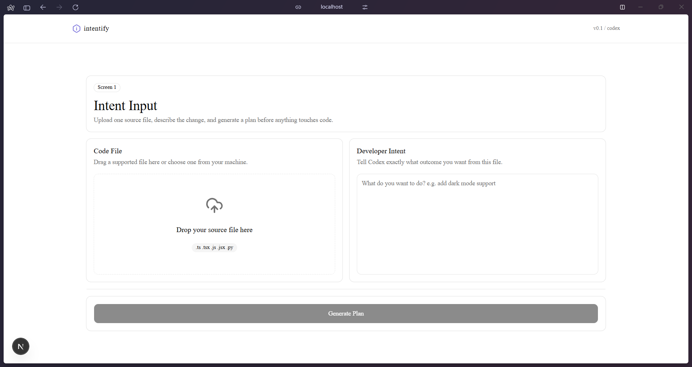
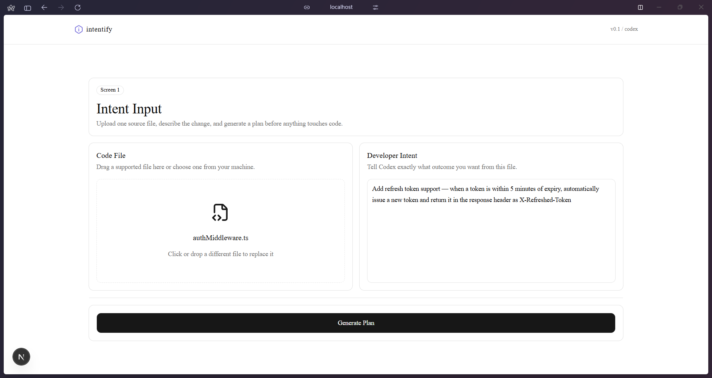
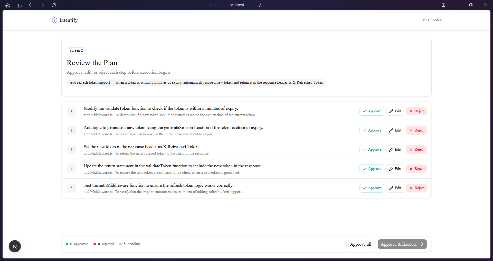
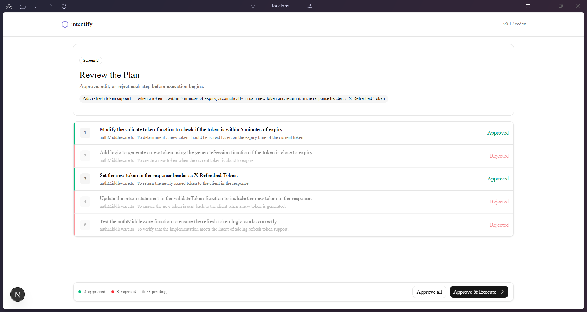
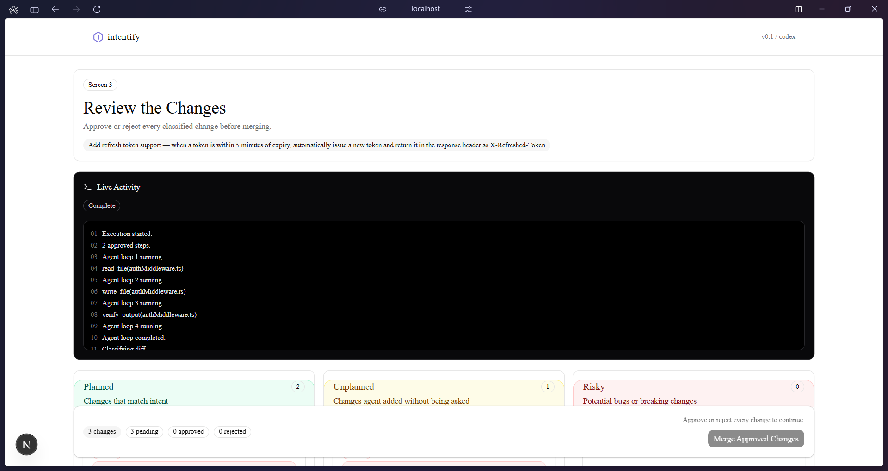
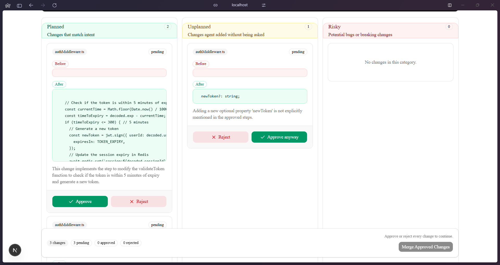
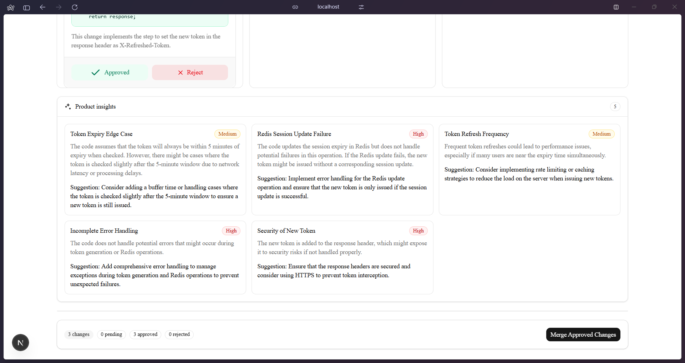
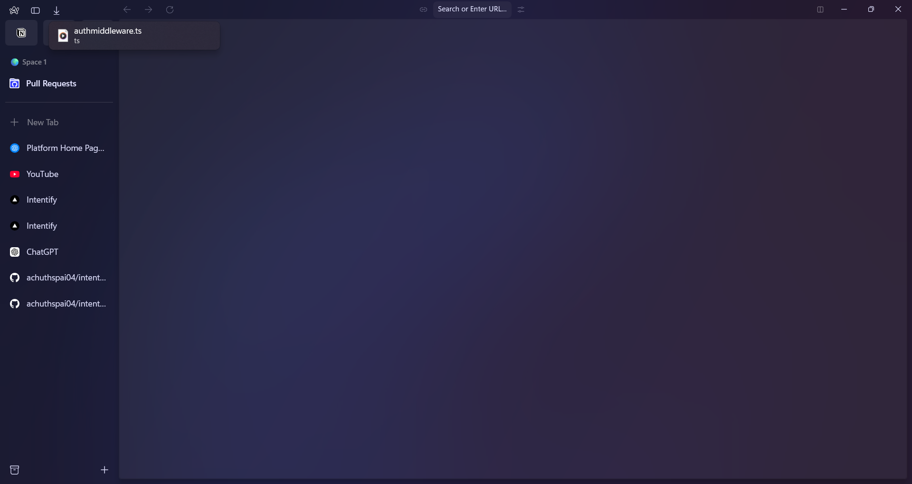
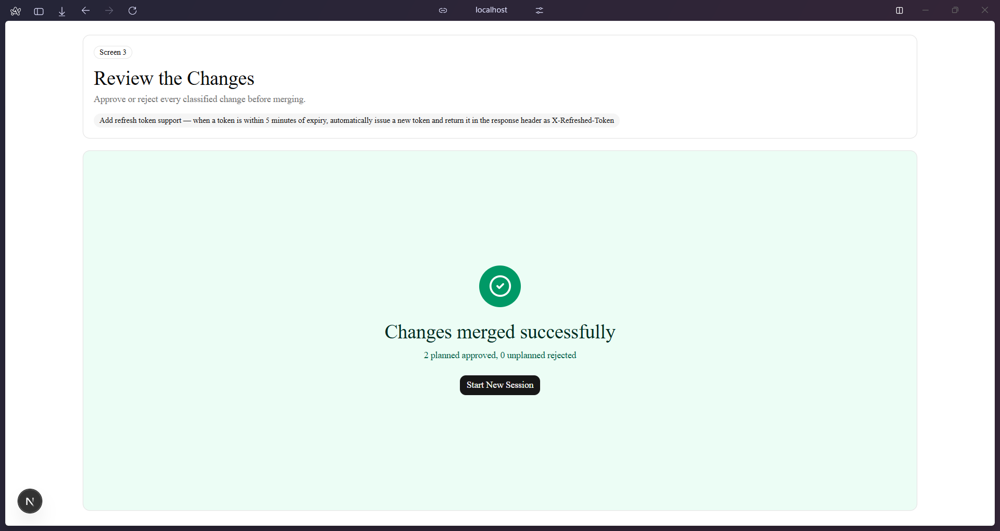

# Intentify

## Overview

Intentify is an intent-first agentic coding interface built on top of OpenAI Codex. It makes the agent's reasoning visible and controllable — showing developers what Codex planned, what it executed, and flagging anything it did beyond what was asked.

## Problem Statement

AI coding agents are powerful but opaque. They act on your intent but also add unplanned changes, touch files you never expected, and make decisions you never approved. Developers either blindly trust the output or spend 45 minutes reviewing a diff they don't understand.

OpenAI said it themselves: "The core challenge has shifted from what agents can do to how people can direct, supervise, and collaborate with them at scale — existing tools are not built to support this way of working."

## Solution

Intentify wraps Codex in a 3-screen human-in-the-loop interface:

1. **Intent Input** — Upload a file, describe what you want in plain English

2. **Plan Approval** — Codex generates a step-by-step plan before touching anything. Approve, edit, or reject each step individually.

3. **Diff Review** — Every change classified as Planned, Unplanned, or Risky. Download the verified file after approval.

A **Product Insights** panel runs a second Codex pass to flag missing edge cases the developer might have missed.

## Features

- Intent-first plan generation — nothing runs until you approve

- Step-level approve / edit / reject controls

- Real-time agent execution feed via Server-Sent Events

- 3-column diff classifier: Planned / Unplanned / Risky

- Line-by-line hunk diffing for precise change detection

- Product insights panel powered by gpt-4o

- Download verified output file after approval

## Tech Stack

- Frontend: Next.js 14 (App Router), Tailwind CSS, shadcn/ui

- Backend: Next.js API routes (serverless)

- Database: None

- APIs: OpenAI gpt-4o + gpt-4o-mini with tool calling

- Hosting: Vercel

## Codex / OpenAI Usage

- **Ideation:** Used ChatGPT to research and validate the problem space

- **Architecture:** Designed the 3-screen agent loop using Codex

- **Code generation:** Entire app built using Codex throughout the hackathon

- **Plan generation:** gpt-4o-mini reads file + intent, returns structured JSON plan

- **Agent execution:** gpt-4o runs tool-calling loop (read_file, write_file, verify_output)

- **Diff classification:** gpt-4o audits every change against approved steps line-by-line

- **Product review:** gpt-4o reviews changes from a senior engineer perspective

- **Debugging:** Codex used iteratively to improve prompt strictness and diff accuracy

## Demo

[Add video link here]

## Screenshots

### 1. Intent input — empty state



### 2. Intent input — file and request ready



### 3. Plan approval — generated steps



### 4. Plan approval — approved and rejected steps



### 5. Diff review — execution feed and classification columns



### 6. Diff review — planned and unplanned change actions



### 7. Product insights — second review pass



### 8. Verified output — downloaded file



### 9. Merge complete — success state



## Recommended Demo Scenario

To best demonstrate Intentify's human-in-the-loop controls:

1. Upload `authMiddleware.ts` (a complex auth/security file)

2. Intent: "Add refresh token support — when a token is within 5 minutes of expiry, automatically issue a new token and return it in the response header as X-Refreshed-Token"

3. On the Plan screen — **Approve steps 1 and 3, Reject steps 2, 4, 5**

   - This forces the agent to improvise, generating unplanned changes

   - Intentify catches everything the agent did beyond your approved scope

4. On the Diff screen — review Planned vs Unplanned vs Risky columns

5. Reject unplanned changes, approve only what you asked for

6. Download the verified file

## How to Run Locally

```bash

git clone https://github.com/YOUR_USERNAME/intentify.git

cd intentify

npm install

cp .env.example .env.local

```

Add your key to .env.local:

```

OPENAI_API_KEY=your_openai_api_key_here

```

Run the app:

```bash

npm run dev

```

Open http://localhost:3000
